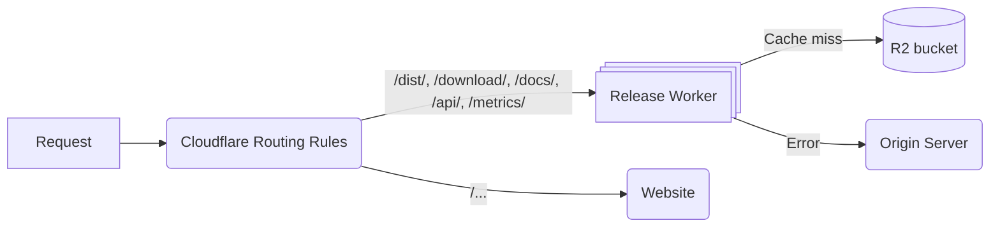
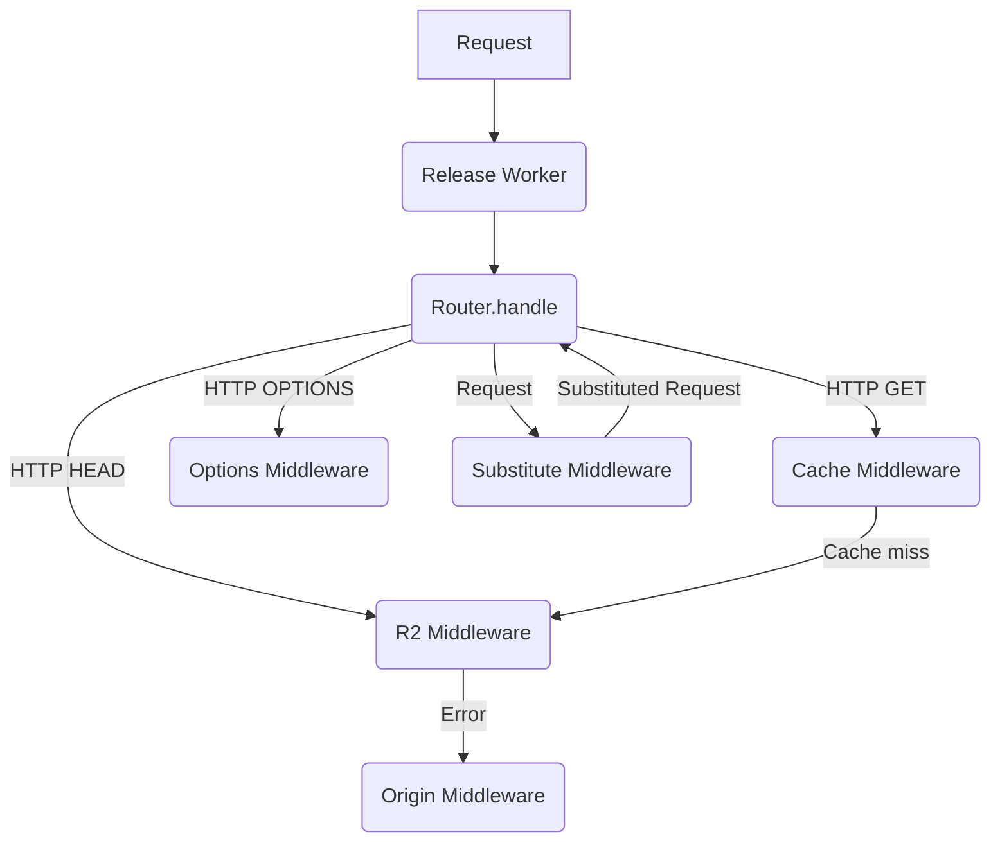

# Architecture

Documentation on the architecture of the worker (i.e. how it works, how it fits into Node.js' infrastructure, etc.).

## Network Request Flow

A high-level overview of how a request flows through Node.js' infrastructure:

## Worker Request Flow

The Release Worker uses a middleware approach to routing requests.

When an instance of the worker starts up, it registers a number of routes and their middlewares.
It then builds a "chain" of middlewares to call in the same order they're given to handle the request.

When a request hits the worker, the router gives it to the first middleware in the chain.
That middleware can then either handle the request and return a response or pass it onto the next middleware.
This goes on until the request is handled or we run out of middlewares to handle the request, upon which we throw an error.

We currently have the following middlewares (in no particular order):

- [CacheMiddleware](../src/middleware/cacheMiddleware.ts) - Caches responses to GET request.
- [R2Middleware](../src/middleware/r2Middleware.ts) - Fetches resource from R2.
- [OriginMiddleware](../src/middleware/originMiddleware.ts) - Fetches resource from the origin server.
  Used as a fallback if the R2 middleware fails.
- [NotFoundMiddleware](../src/middleware/notFoundMiddleware.ts) - Handles not found requests.
- [OptionsMiddleware](../src/middleware/optionsMiddleware.ts) - Handles OPTIONS requests.
- [SubstituteMiddleware](../src/middleware/subtituteMiddleware.ts) - Handles requests that need URL substituing (i.e. `/dist/latest/` -> `/dist/<latest version>`) and then feeds them back into the router.

### Diagram

